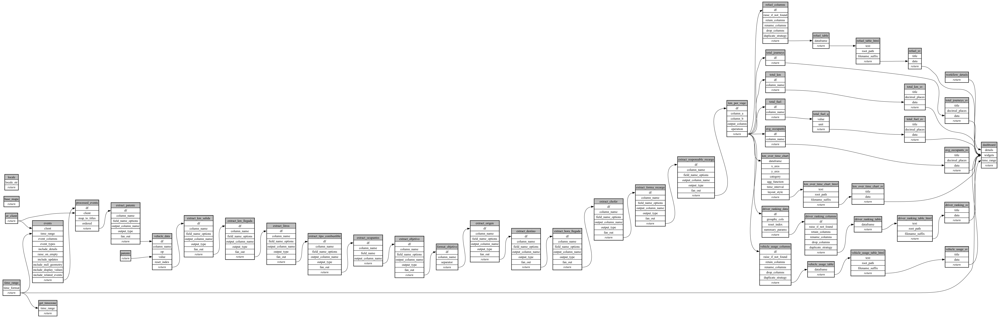

```
# AUTOGENERATED BY ECOSCOPE-WORKFLOWS; see fingerprint in README.md for details

```

```yaml
# fingerprint:
artifacts_sha256_basic: 558ddb586583a014b921d4eb573d4457fe71f30ba0c4b89adc7edfe59230e7da
artifacts_sha256_strict: 381ca66e52bb425a32be17b1a2677f326e46fa6ea77e59c50a22514550cfdfc0
installed_requirements:
- channel: https://repo.prefix.dev/ecoscope-workflows/
  name: ecoscope-platform
  version: {version: ==2.23.0}
- channel: https://repo.prefix.dev/ecoscope-workflows-custom/
  name: ecoscope-workflows-ext-custom
  version: {version: ==0.1.0rc23}
- channel: conda-forge
  name: pydeck
  version: {version: ==0.9.2}
- channel: https://repo.prefix.dev/ecoscope-workflows-custom/
  name: ecoscope-workflows-ext-apn
  version: {version: ==0.0.30}
params_sha256: 6f09f0fca5f6ad2477aa5df37dd280b945f51d4cdb6c8f62483658fd285e8e76
spec_sha256: 0e1aa538457b0f018a09c70232b2f2118c7c5336860daad8affdf18511811d35

```

# ecoscope-workflows-vehicle-workflow


